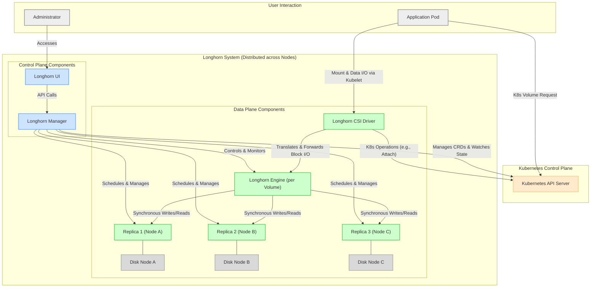
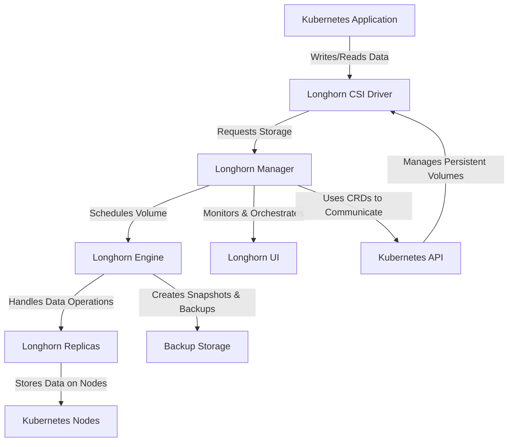
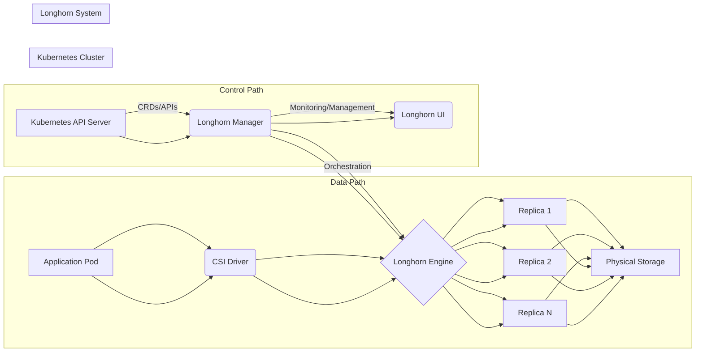

Complex:

```mermaid
graph TD
    subgraph "User Interaction"
        AppPod[Application Pod]
        Admin[Administrator]
    end

    subgraph "Kubernetes Control Plane"
        K8sAPI[Kubernetes API Server]
    end

    subgraph "Longhorn System (Distributed across Nodes)"
        direction LR
        subgraph "Control Plane Components"
            Mgr[Longhorn Manager]
            UI[Longhorn UI]
        end
        subgraph "Data Plane Components"
            CSI[Longhorn CSI Driver]
            Engine["Longhorn Engine (per Volume)"]
            Replica1["Replica 1 (Node A)"] --- PhysicalStorage1[Disk Node A]
            Replica2["Replica 2 (Node B)"] --- PhysicalStorage2[Disk Node B]
            Replica3["Replica 3 (Node C)"] --- PhysicalStorage3[Disk Node C]
        end
    end

    AppPod -- K8s Volume Request --> K8sAPI
    AppPod -- Mount & Data I/O via Kubelet --> CSI

    CSI -- K8s Operations (e.g., Attach) --> K8sAPI
    CSI -- Translates & Forwards Block I/O --> Engine

    Engine -- Synchronous Writes/Reads --> Replica1
    Engine -- Synchronous Writes/Reads --> Replica2
    Engine -- Synchronous Writes/Reads --> Replica3

    Mgr -- Manages CRDs & Watches State --> K8sAPI
    Mgr -- Controls & Monitors --> Engine
    Mgr -- Schedules & Manages --> Replica1 & Replica2 & Replica3

    Admin -- Accesses --> UI
    UI -- API Calls --> Mgr

    classDef controlPlane fill:#cde4ff,stroke:#77aaff,stroke-width:2px;
    classDef dataPlane fill:#ccffcc,stroke:#66cc66,stroke-width:2px;
    classDef k8s fill:#ffebcc,stroke:#ffcc80,stroke-width:2px;
    classDef user fill:#eeeeee,stroke:#999999,stroke-width:2px;
    classDef storage fill:#d9d9d9,stroke:#777777,stroke-width:1px;


    class Mgr,UI controlPlane
    class Engine,Replica1,Replica2,Replica3,CSI dataPlane
    class K8sAPI k8s
    class AppPod,Admin user
    class PhysicalStorage1,PhysicalStorage2,PhysicalStorage3 storage
```

Simpler(1):

```mermaid
graph TD;
    A[Kubernetes Application] -->|Writes/Reads Data| B[Longhorn CSI Driver]
    B -->|Requests Storage| C[Longhorn Manager]
    C -->|Schedules Volume| D[Longhorn Engine]
    D -->|Handles Data Operations| E[Longhorn Replicas]
    E -->|Stores Data on Nodes| F[Kubernetes Nodes]
    D -->|Creates Snapshots & Backups| G[Backup Storage]
    C -->|Monitors & Orchestrates| H[Longhorn UI]
    C -->|Uses CRDs to Communicate| I[Kubernetes API]
    I -->|Manages Persistent Volumes| B
```

Simpler(2)

```mermaid
graph LR
    A[Application Pod] --> B(CSI Driver);
    B --> C{Longhorn Engine};
    C --> D[Replica 1];
    C --> E[Replica 2];
    C --> F[Replica N];
    D --> G[Physical Storage];
    E --> G;
    F --> G;
    H[Kubernetes API Server] -- CRDs/APIs --> I(Longhorn Manager);
    I -- Orchestration --> C;
    I -- Monitoring/Management --> J(Longhorn UI);
    subgraph "Data Path"
        A --> B --> C --> D & E & F --> G;
    end
    subgraph "Control Path"
        H --> I --> C & J;
    end
    subgraph "Kubernetes Cluster"
        A; B; H;
    end
    subgraph "Longhorn System"
        C; D; E; F; G; I; J;
    end
```