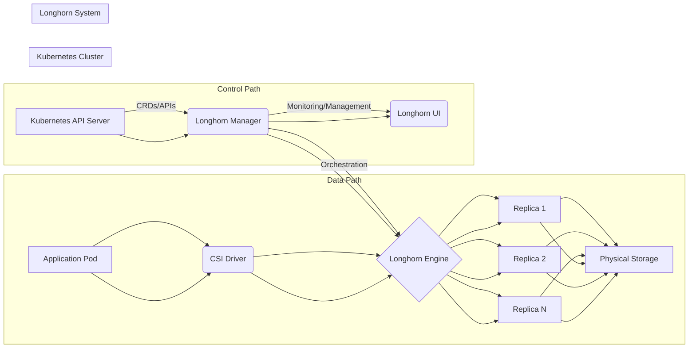
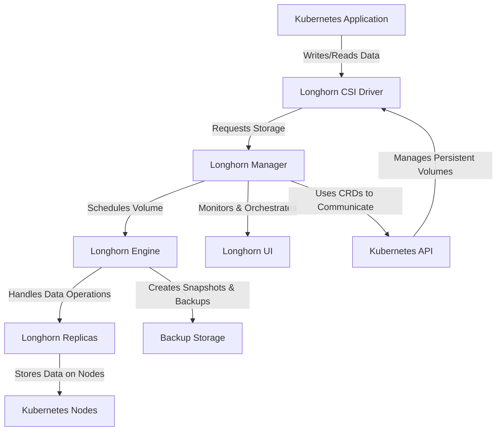

## Introduction
When are working with Kubernetes, our applications scale and shift in an instant, one fundamental challenge stands out which is  **persistent storage**. So, the question is how to ensure that the critical data does not get lost due to the ephemeral nature of containers? The traditional storage solutions require complex configurations, performance issues, and it is a headache for DevOps teams.

Applications that needs stateful data also need a storage system that is highly available, scalable and easy to manage. This is where [Longhorn](https://longhorn.io/) comes as a solution. Longhorn is a cloud-native, distributed block storage solution designed to simplify persistent storage for Kubernetes. It is a storage system that’s just as flexible and resilient as the containerized applications. Longhorn integrates with the Kubernetes environment with ease. It offers simplicity, reliability, automated data replication, snapshotting, backup capabilities, self-healing features, and ease of use.


## The Problem Longhorn Solves
Kubernetes provides scalability and flexibility which helps in easy deployment of containerized applications. But Kubernetes is designed to handle ephemeral workloads which means that if a container dies, its local storage disappears with it. However stateful applications like databases, message queues, and logging systems need storage which is persistent in nature. There are other challenges associated with the traditional storage solutions:
1. Setting up and managing storage required manual configurations of storage classes, volumes, and replication strategies.
2. Traditional storage solutions are generally not optimized for distributed system which leads to increased latency and reduced performance.

These issues are solved by Longhorn. Longhorn is a lightweight, scalable and distributed block storage solution built for Kubernetes. It works natively with Kubernetes Storage Classes, Persistent Volumes (PVs), and Persistent Volume Claims (PVCs).

Longhorn utilizes the distributed architecture Kubernetes to provide synchronous data replication across multiple nodes, resilience and fault tolerance. This makes it possible to maintain data integrity even in the event of node failures. Longhorn simplifies storage management and allows users to provision, expand and manage volumes efficiently with the help of Kubernetes-  APIs.


## Core Components of Longhorn

### Longhorn Engine (Manages Volume Operations)
Longhorn Engine is the data plane component responsible for handling all I/O operations for a specific volume. It runs as a Linux process and operates on a per-volume basis which means each Longhorn volume has its own dedicated engine (controller). Longhorn Engine is one of the most important component which provides data consistency, availability and resilience through synchronous replication and fault recovery mechanisms.

### Responsibilities of the Longhorn Engine
#### Data Replication and Recovery
By default, each Longhorn volume is configured with two replicas. The Longhorn Engine synchronously replicates all write operations across these replicas to ensure data redundancy and fault tolerance. If a replica fails, the engine automatically rebuilds it using an existing healthy replica. This helps in maintaining data integrity without manual intervention.

#### Handling Input-Output Requests
The Longhorn Engine lies between the application and the storage system. It receives block-level read and write requests via the Container Storage Interface (CSI) driver and efficiently processes them.

#### Snapshot and Backup Handling
Longhorn supports snapshot creation and incremental backups.

#### Volume Management
The Longhorn Engine enables dynamic volume provisioning, resizing and deletion. These features simplifying storage operations within Kubernetes environments.

#### Replica Management
The Longhorn Engine continuously checks health of replicas and initiates automatic repairs or resynchronization in case of failures and inconsistencies.

#### Network Communication
The Longhorn Engine uses a distributed block device layer to abstract the underlying storage infrastructure. This allows volumes to function reliably across different nodes without direct dependency on physical storage locations.

#### Performance Optimization
The Longhorn Engine is designed to handle high-throughput workloads efficiently. It utilizes intelligent caching and distributed storage mechanisms to minimize latency and ensures consistent performance for stateful applications.


### Longhorn Manager
The Longhorn Manager is the control plane component that orchestrates and manages the Longhorn system. It operates as Kubernetes daemon set and interacts with the Kubernetes API server. It runs as a Kubernetes controller, manages storage requests, maintains volume metadata, and it also ensures the proper scheduling of Longhorn operations.

### Responsibilities of Longhorn Manager
#### Volume Scheduling and Lifecycle Management
Longhorn Manager determines the accurate placement of volumes and replicas across the Kubernetes cluster by considering factors like node availability, storage capacity, and data locality. It handles the creation, expansion, migration, deletion and maintenance of Longhorn volumes.

#### Scheduling and Replica Coordination
The Longhorn Manager ensures that the replicas are distributed across the available nodes.

#### Snapshot and Backup Coordination
The Longhorn Manager coordinates snapshot and backup operations to ensure data consistency and integrity.

#### Health Monitoring and Failover Handling
The Longhorn Manager monitors the health of the Longhorn system. It detects and responds to node failures and other issues. It also works to ensure that the actual state of the Longhorn system matches the desired state defined by the user.

#### Kubernetes Integration
The Longhorn Manager uses Kubernetes Custom Resource Definitions (CRDs) to interact with Kubernetes and manage storage natively within clusters.

> **Note**: Each node in the Kubernetes cluster runs an instance of Longhorn Manager, which communicates with other managers to maintain a distributed storage control plane.


### Longhorn UI
The Longhorn UI provides a web-based interface used by administrators for managing and monitoring Longhorn volumes .

#### Features of Longhorn UI
- It provides user-friendly visual representation (graphical overview) of the Longhorn volumes, replicas, snapshots, and backups.
- It allows users to create, delete, resize, manage, and monitor volumes, snapshots, and backups.
- It displays real-time metrics and health statuses of storage components.
- It provides alerts and notifications for critical events.
- It also offers tools for troubleshooting and failure recovery through logs and system events.

> **Note**: Longhorn can be fully managed via `kubectl` and APIs, the UI provides an intuitive alternative for non-CLI users.


### Longhorn CSI Driver
The **Container Storage Interface (CSI) Driver** is the component that allows Kubernetes workloads to interact with Longhorn as a persistent storage provider using the standard CSI interface.

The CSI driver enables Kubernetes applications to use Longhorn storage as if they were interacting with any other cloud-native storage provider, making it fully compatible with Kubernetes storage operations.

#### Responsibilities of Longhorn CSI Driver
- It enables Kubernetes to automatically create and attach Longhorn volumes when needed.
- It allows applications to request persistent storage dynamically.
- It translates Kubernetes storage requests into Longhorn API calls.
- It allows dynamic provisioning of Longhorn volumes using StorageClasses.
- It works with Kubernetes to support volume snapshots and backups for disaster recovery.
- It acts as an important component for the integration of Longhorn into the Kubernetes ecosystem.


### Longhorn Replicas
A Longhorn Replica is a copy of a Longhorn volume stored on a different node. Longhorn ensures that every volume has multiple replicas as it helps to prevent data loss and provides synchronization. In case if a node or replica fails, Longhorn easily switches to another replica minimizing the downtime. The number of replicas can be configured based on the desired level of data redundancy.

### Working of Replicas in Longhorn
When a volume is created, Longhorn automatically provisions multiple replicas based on user-defined redundancy policies. The Longhorn Engine writes data simultaneously to all active replicas. If a node running a replica **fails**, Longhorn promotes one of the healthy replicas as the primary data source and starts rebuilding the lost replica on another node.


### Data Path
The data path describes how data is transmitted from an application pod to Longhorn storage. When an application reads data, the Longhorn Engine retrieves it from a replica and serves it back via the CSI driver.

```plaintext
Pod -> CSI Driver -> Longhorn Engine -> Replicas -> Physical Storage.
```

#### Steps (Flow of Data):
1. A Kubernetes workload writes data to a **Persistent Volume** backed by Longhorn.
2. The Kubernetes **CSI Driver** intercepts the request and routes it to the Longhorn Engine.
3. The **Longhorn Engine** processes the write operation and ensures it is applied consistently across all active replicas. The engine writes the same data across multiple **Longhorn Replicas** to ensure redundancy.
4. Each replica stores data in a block storage file on a separate Kubernetes node.

### Control Path
The control path involves the communication between the Longhorn Manager and the Longhorn Engines. The control path ensures that Longhorn remains highly available even in cloud environments.

**Diagram Option - 1**:

**Diagram Option - 2**:


## How Longhorn Works Behind the Scenes
Longhorn's strength is its ability to simplify complex storage operations as well as ensuring data reliability and performance. Longhorn’s storage operations follow a structured workflow to ensure data integrity and high availability.

### Volume Creation
When a user creates a PVC (PersistentVolumeClaim) in Kubernetes, the CSI driver translates this request into a Longhorn API call. The Longhorn Manager then provisions a new volume and assigns it to a node based on scheduling policies. At last, the Longhorn Engine is created, and replicas are initialized on the selected nodes for redundancy.

### Volume Replication
* When an application writes data to the volume, the write request goes through the CSI driver to the Longhorn Engine. The Longhorn Engine synchronously replicates the write operation to all replicas to ensure data consistency.

### Snapshot and Backup
A snapshot creates a point-in-time copy of current state of the volume's data. Longhorn uses a block-level snapshotting mechanism, efficiently capturing the state of the volume.
Longhorn can backup snapshots to external storage such as NFS or AWS S3 compatible object stores.

Scheduling policies help **optimize performance** and **maintain high availability**.

### Thin Provisioning
Longhorn uses thin provisioning which means that the storage space is allocated on demand. Instead of reserving the entire requested storage up front, Longhorn allocates space gradually as data is written.

Thin provisioning helps to efficient use storage resources as only the actual used space is allocated. This is especially helpful in environments where storage usage fluctuates.

### Data Locality
Longhorn attempts to place replicas on nodes that are close to the application pods that are using the volume. This helps to minimize the network latency and improves performance.

#### Example
If a volume’s primary workload runs on **Node A**, Longhorn ensures at least one replica exists on the same node. It helps to reduce **network latency** since data does not need to travel between nodes. Now, if the workload moves to **Node B**, Longhorn dynamically adjusts replica placement to optimize locality.

> **Note**: Longhorn follows node affinity rules when scheduling volumes and replicas. Longhorn also attempt to keep replicas on different storage disks, to minimize the impact of disk failure.


### Volume Scheduling
Longhorn dynamically schedules volumes and their replicas based on factors like:
1. **Available disk space**
2. **Replica count settings**
3. **Node health**
4. **Scheduling policies**
5. **Data locality preferences**


### Node Affinity
Longhorn utilizes Kubernetes node affinity rules to ensure that replicas are placed on specific nodes or groups of nodes. Node affinity can be used to ensure that replicas are placed on nodes with specific storage characteristics or network connectivity.

#### Longhorn’s Node Affinity Rules
- **Soft Affinity**: Prefer certain nodes but allow scheduling on others if needed.
- **Hard Affinity**: Restrict volumes to specific nodes for data locality and latency reduction.
- **Anti-Affinity**: Prevent volumes from being placed on the same node to improve fault tolerance.


## Integration and Interactions between Longhorn and Kubernetes
Longhorn is designed around tight integration with Kubernetes which enables it to act as a built-in storage solution within the container orchestration ecosystem.

### How Longhorn integrates with Kubernetes’ storage classes, volumes, PVCs and CSI
Longhorn utilizes Kubernetes StorageClasses to define different storage provisioning policies such as replication count, snapshot frequency, and backup configurations. Users can create PVCs referencing these StorageClasses, and Longhorn would dynamically provision the required Persistent Volumes (PVs). This enables on-demand storage provisioning based on application requirements. The CSI driver acts as the bridge, translating Kubernetes storage requests into Longhorn API calls. This allows pods to mount Longhorn volumes just like any other Kubernetes-supported storage back-end.

Longhorn is **fully compliant** with the Container Storage Interface (CSI) standards.

### Kubernetes Pod Interaction
Pods interact with Longhorn volumes through PVCs. The CSI driver mounts the Longhorn volume to the pod's file system which allows the application to read and write data. Kubernetes handles the mounting and unmounting of the volumes.

### Integration with Rancher
Longhorn is a **CNCF** project developed by **Rancher** which makes it the default storage solution in Rancher-managed Kubernetes clusters.

#### Advantages of Longhorn-Rancher Integration
- Longhorn can be installed directly from the Rancher UI.
- Rancher provides an interactive visual dashboard for managing Longhorn volumes, backups, and snapshots.


## Setting Up and Using Longhorn
Longhorn can be installed using Helm, `kubectl` or the Rancher UI.

### Installation Process - Helm Chart
Helm is the recommended method for installing Longhorn. It simplifies the deployment and management of Longhorn components. Longhorn Helm repository can be added and installed with a few simple commands.

For detailed, installation steps, [click here](https://longhorn.io/docs/1.8.1/deploy/install/install-with-helm/).

### Installation Process - `kubectl`
Longhorn can also be installed using `kubectl` by applying the provided YAML manifests. This method is more manual but provides greater control over the installation process. This is useful for environments without Helm.

For detailed, installation steps, [click here](https://longhorn.io/docs/1.8.1/deploy/install/install-with-kubectl/).

### Installation Process - Rancher UI
Longhorn can be easily installed through the Rancher UI. This is the simplest way to install Longhorn if Rancher is already deployed.


For detailed, installation steps, [click here](https://longhorn.io/docs/1.8.1/deploy/install/install-with-rancher/).


Longhorn can be [installed](https://longhorn.io/docs/1.8.1/deploy/install/) on a Kubernetes cluster using other ways:
- Helm Controller
- Fleet
- Flux
- ArgoCD

## Basic Configuration and Best Practices
- Ensure that Kubernetes cluster meets the minimum requirements for Longhorn. Click [here](https://longhorn.io/docs/1.8.1/deploy/install/#installation-requirements) for more details.
- Configure the number of replicas based on data redundancy requirements.
- Monitor storage usage and performance to identify potential bottlenecks.
- Use dedicated storage devices for Longhorn volumes to improve performance.
- Ensure that the nodes that longhorn runs on have sufficient resources.
- Ensure that the network between the nodes is stable and fast.


## Conclusion
Longhorn delivers simplified, easy to deploy and upgrade, 100% open source, cloud-native persistent block storage without the cost overhead of open core or proprietary alternatives.

Longhorn's architecture, built on distributed block storage and synchronous replication, provides high availability and data durability. Its integration with the Kubernetes CSI standard simplifies storage management and allows for dynamic provisioning of volumes.

The Longhorn project continues to evolve, with ongoing development and improvements.

Longhorn is **open-source**, and contributions are always welcome.