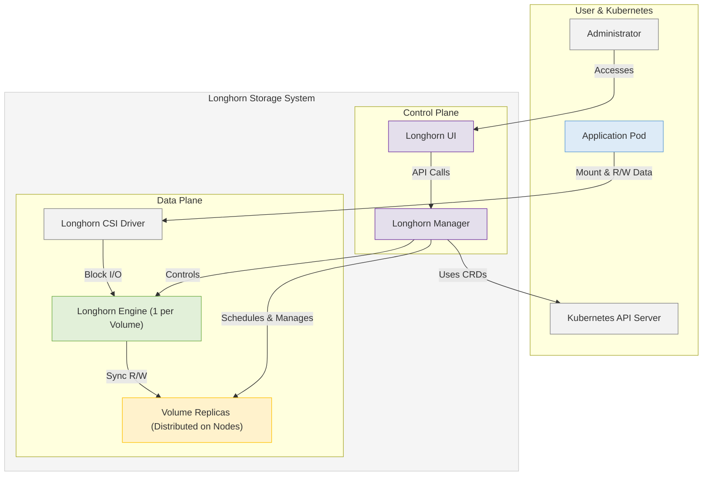

## Introduction
When working with Kubernetes, applications scale and shift fast, one fundamental challenge that stands is persistent storage. The question is how to ensure critical data does not get lost due to the ephemeral nature of containers? The traditional storage solutions require complex configurations, performance issues, and in general it is a big problem for DevOps teams.

Applications that need stateful data also need a storage system that is highly available, scalable, and easy to manage.

## Why Longhorn
Kubernetes provides scalability and flexibility which helps in easy deployment of containerized applications. But Kubernetes is designed to handle ephemeral workloads, meaning that if a container dies, its local storage disappears with it. However, stateful applications such as databases, message queues, and logging systems require storage that is persistent in nature. Utilizing traditional storage solutions in this dynamic environment introduces significant challenges: setting up and managing storage often requires complex manual configurations of storage classes, volumes, and replication strategies, and these solutions are generally not optimized for distributed systems, potentially leading to increased latency and reduced performance.

To address these persistent storage challenges, [Longhorn](https://longhorn.io/) emerges as a specifically designed solution for Kubernetes. It is a cloud-native, lightweight, and distributed block storage system offering flexibility and resilience comparable to the containerized applications it supports. Addressing the limitations of traditional approaches, Longhorn leverages Kubernetes' distributed architecture to provide high availability and fault tolerance through synchronous data replication across multiple nodes, ensuring data integrity even if nodes fail while being optimized for performance in a distributed environment.

Furthermore, Longhorn integrates seamlessly and works natively with core Kubernetes storage concepts like Storage Classes, Persistent Volumes (PVs), and Persistent Volume Claims (PVCs). This significantly simplifies storage management compared to manual configurations, allowing users to efficiently provision, expand, and manage volumes using familiar Kubernetes-native APIs. Overall, Longhorn offers simplicity, reliability, automated snapshotting and backup capabilities, and self-healing features, making it a scalable and easy-to-use solution for running stateful applications on Kubernetes.

## Longhorn Architecture
Longhorn's' architecture is divided into distinct control and data planes to manage storage resources effectively.
- The **Control Plane**, orchestrated by the Longhorn Manager, is responsible for overall system management. This includes volume creation, scheduling replicas across cluster nodes, monitoring component health, and integrating with the Kubernetes API.
- The **Data Plane** handles all the input output operations. It involves the Longhorn Engine (a dedicated controller for each volume), Longhorn Replicas (which maintain redundant copies of volume data on different nodes for high availability), and the Longhorn CSI Driver (which enables seamless communication between Kubernetes pods and Longhorn volumes).

Additionally, an optional Longhorn UI offers a graphical interface for monitoring and managing the storage system. This component-based architecture ensures resilience and simplifies storage operations within a Kubernetes environment.



### Operational Flow of Data and Control Paths
#### Data Path
This describes how application data is read from and written to Longhorn volumes.
1. An application pod interacts with its persistent volume, which triggers requests via the Kubernetes `kubelet` to the **Longhorn CSI Driver**.
2. The CSI driver translates and forwards these block I/O requests to the dedicated **Longhorn Engine** managing that specific volume.
3. The Engine processes the operation:
   - For writes, it synchronously replicates the data across all active, healthy **Replicas** (each typically residing on a different node and storing the data on its physical disk).
   - For reads, it retrieves data from a suitable healthy replica and returns it via the CSI driver back to the application.

This flow essentially follows:
```
Pod -> Kubelet -> CSI Driver -> Longhorn Engine -> Replicas -> Physical Storage
```

#### Control Path
This involves the management and orchestration of the Longhorn system.
1. The **Longhorn Manager** communicates with the **Kubernetes API server**, using Custom Resource Definitions (CRDs) to define and observe the state of volumes and other Longhorn resources.
2. It also communicates directly with the **Longhorn Engines** to issue commands for actions like snapshot creation, replica rebuilding, and volume attachment/detachment.
3. This ensures the cluster's actual storage state aligns with the user's desired configuration and maintains high availability.


### Longhorn Engine
Longhorn Engine is the data plane component responsible for handling all I/O operations for a specific volume. It runs as a Linux process and operates on a per-volume basis which means each Longhorn volume has its own dedicated engine (controller). Longhorn Engine is one of the most important components which provides data consistency, availability, and resilience through synchronous replication and fault recovery mechanisms.

The following are the main tasks that the Longhorn engine manages:
- **Data Replication and Recovery** - By default, each Longhorn volume is configured with two replicas. The Longhorn Engine synchronously replicates all write operations across these replicas to ensure data redundancy and fault tolerance. If a replica fails, the engine automatically rebuilds it using an existing healthy replica. This helps maintain data integrity without manual intervention.
- **Handling Input/Output Requests** - The Longhorn Engine lies between the application and the storage system. It receives block-level read and write requests via the Container Storage Interface (CSI) driver and efficiently processes them.
- **Snapshot and Backup Handling** - Longhorn supports snapshot creation and incremental backups.
- **Volume Management** - The Longhorn Engine enables dynamic volume provisioning, resizing, and deletion. These features simplify storage operations within Kubernetes environments.
- **Replica Management** - The Longhorn Engine continuously checks the health of replicas and initiates automatic repairs or resynchronization in case of failures and inconsistencies.
- **Network Communication** - The Longhorn Engine uses a distributed block device layer to abstract the underlying storage infrastructure. This allows volumes to function reliably across different nodes without direct dependency on physical storage locations.
- **Performance Optimization** - The Longhorn Engine is designed to handle high-throughput workloads efficiently. It utilizes intelligent caching and distributed storage mechanisms to minimize latency and ensures consistent performance for stateful applications.


### Longhorn Manager
The Longhorn Manager is the control plane component that orchestrates and manages the Longhorn system. It operates as a Kubernetes daemon set and interacts with the Kubernetes API server. It runs as a Kubernetes controller, manages storage requests, maintains volume metadata, and it also ensures the proper scheduling of Longhorn operations.

The following are the main tasks of the Longhorn manager:
- **Volume Scheduling and Lifecycle Management** - The Longhorn Manager determines the accurate placement of volumes and replicas across the Kubernetes cluster by considering factors like node availability, storage capacity, and data locality. It is responsible for the creation, expansion, migration, deletion, and maintenance of Longhorn volumes.
- **Scheduling and Replica Coordination** - The Longhorn Manager ensures that the replicas are distributed across the available nodes.
- **Snapshot and Backup Coordination** - The Longhorn Manager coordinates snapshot and backup operations to ensure data consistency and integrity.
- **Health Monitoring and Failover Handling** - The Longhorn Manager monitors the health of the Longhorn system. It detects and responds to node failures and other issues. It also works to ensure that the actual state of the Longhorn system matches the desired state defined by the user.
- **Kubernetes Integration** - The Longhorn Manager uses Kubernetes Custom Resource Definitions (CRDs) to interact with Kubernetes and manage storage natively within clusters.

> **Note**: Each node in the Kubernetes cluster runs an instance of Longhorn Manager, which communicates with other managers to maintain a distributed storage control plane.

### Longhorn UI
The Longhorn UI provides a web-based interface used by administrators for managing and monitoring Longhorn volumes .

The following are the main features of Longhorn UI:
- It provides user-friendly visual representation (graphical overview) of the Longhorn volumes, replicas, snapshots, and backups.
- It allows users to create, delete, resize, manage, and monitor volumes, snapshots, and backups.
- It displays real-time metrics and health statuses of storage components.
- It provides alerts and notifications for critical events.
- It also offers tools for troubleshooting and failure recovery through logs and system events.

> **Note**: Longhorn can be fully managed via `kubectl` and APIs, the UI provides an intuitive alternative for non-CLI users.


### Longhorn CSI Driver
The Container Storage Interface (CSI) Driver is the component that allows Kubernetes workloads to interact with Longhorn as a persistent storage provider using the standard CSI interface.

The CSI driver enables Kubernetes applications to use Longhorn storage as if they were interacting with any other cloud-native storage provider, making it fully compatible with Kubernetes storage operations.

Following are the main responsibilities of the Longhorn CSI Driver:
- It enables Kubernetes to automatically create and attach Longhorn volumes when needed.
- It allows applications to request persistent storage dynamically.
- It translates Kubernetes storage requests into Longhorn API calls.
- It allows dynamic provisioning of Longhorn volumes using StorageClasses.
- It works with Kubernetes to support volume snapshots and backups for disaster recovery.
- It acts as an important component for Longhorn integration into the Kubernetes ecosystem.

### Longhorn Replicas
A Longhorn Replica is a copy of a Longhorn volume stored on a different node. It is crucial for data redundancy and high availability. The number of replicas for each volume is configurable based on desired resilience levels.

When a volume is created, Longhorn automatically provisions the specified number of replicas according to defined policies. The Longhorn Engine ensures data consistency by writing synchronously to all active replicas.

If a node hosting a replica fails, Longhorn seamlessly promotes a healthy replica to become the primary data source, minimizing downtime. It then automatically initiates rebuilding the lost replica on another available node to restore the configured redundancy level.


## How does Longhorn work?
Longhorn's strength is its ability to simplify complex storage operations and ensure data reliability and performance. Longhorn’s storage operations follow a structured workflow to ensure data integrity and high availability.

### Volume Creation
When a user creates a PVC (PersistentVolumeClaim) in Kubernetes, the CSI driver translates this request into a Longhorn API call. The Longhorn Manager then provisions a new volume and assigns it to a node based on scheduling policies. At last, the Longhorn Engine is created, and replicas are initialized on the selected nodes for redundancy.

### Volume Replication
When an application writes data to the volume, the write request goes through the CSI driver to the Longhorn Engine. The Longhorn Engine synchronously replicates the write operation to all replicas to ensure data consistency.

### Snapshot and Backup
A snapshot creates a point-in-time copy of the current state of the volume's data. Longhorn uses a block-level snapshotting mechanism, efficiently capturing the state of the volume. Longhorn can backup snapshots to external storage such as NFS or AWS S3 compatible object stores.

Scheduling policies help optimize performance and maintain high availability.

### Thin Provisioning
Longhorn uses thin provisioning, meaning storage space is allocated on demand. Instead of reserving the entire requested storage up front, Longhorn allocates space gradually as data is written.

hin provisioning helps to efficiently use storage resources as only the actual used space is allocated. This is especially helpful in environments where storage usage fluctuates.

### Data Locality
Longhorn attempts to place replicas on nodes that are close to the application pods that are using the volume. This helps minimize network latency and improves performance. For example: If a volume’s primary workload runs on Node A, Longhorn ensures at least one replica exists on the same node. It helps reduce network latency since data does not need to travel between nodes. Now, if the workload moves to Node B, Longhorn dynamically adjusts replica placement to optimize locality.

> **Note**: Longhorn follows node affinity rules when scheduling volumes and replicas. Longhorn will also attempt to keep replicas on different storage disks, to minimize the impact of disk failure.

### Volume Scheduling
Longhorn dynamically schedules volumes and their replicas based on factors like:
1. Available disk space
2. Replica count settings
3. Node health
4. Scheduling policies
5. Data locality preferences


### Node Affinity
Longhorn utilizes Kubernetes node affinity rules to ensure that replicas are placed on specific nodes or groups of nodes. Node affinity can be used to ensure that replicas are placed on nodes with specific storage characteristics or network connectivity.


### Longhorn’s Node Affinity Rules
- **Soft Affinity**: Prefer certain nodes but allow scheduling on others if needed.
- **Hard Affinity**: Restrict volumes to specific nodes for data locality and latency reduction.
- **Anti-Affinity**: Prevent volumes from being placed on the same node to improve fault tolerance.

## Integration and Interactions between Longhorn and Kubernetes
Longhorn is designed around tight integration with Kubernetes which enables it to act as a native storage solution within the container orchestration ecosystem.

### How Longhorn integrates with Kubernetes’ storage classes, volumes, PVCs and CSI
Longhorn utilizes Kubernetes StorageClasses to define different storage provisioning policies such as replication count, snapshot frequency, and backup configurations. Users can create PVCs referencing these StorageClasses, and Longhorn will dynamically provision the required Persistent Volumes (PVs). This enables on-demand storage provisioning based on application requirements. The CSI driver acts as the bridge, translating Kubernetes storage requests into Longhorn API calls. This allows pods to mount Longhorn volumes just like any other Kubernetes-supported storage backend.

Longhorn is fully compliant with the Container Storage Interface (CSI) standards.

### Kubernetes Pod Interaction
Pods interact with Longhorn volumes through PVCs. The CSI driver mounts the Longhorn volume to the pod's file system which allows the application to read and write data. Kubernetes handles the mounting and unmounting of the volumes.

### Integration with Rancher
Longhorn is a CNCF project developed by Rancher which makes it the default storage solution in Rancher-managed Kubernetes clusters.

#### Advantages of Longhorn-Rancher Integration
- Longhorn can be installed directly from the Rancher UI.
- Rancher provides an interactive visual dashboard for managing Longhorn volumes, backups, and snapshots.


## Installing Longhorn
Longhorn can be installed using Helm, kubectl, or the Rancher UI. Ensure that Kubernetes cluster meets the minimum requirements for Longhorn. Click [Installation Requirements](https://longhorn.io/docs/1.8.1/deploy/install/#installation-requirements) for more details.

### Installation using Helm Chart
Helm is the recommended method for installing Longhorn. It simplifies the deployment and management of Longhorn components. Longhorn Helm repository can be added and installed with a few simple commands.

For detailed installation steps, click [Install with Helm](https://longhorn.io/docs/1.8.1/deploy/install/install-with-helm/).

### Installation using kubectl
Longhorn can also be installed using kubectl by applying the provided YAML manifests. This method is more manual but provides greater control over the installation process. This is useful for environments without Helm.
For detailed installation steps, click [Install with Kubectl](https://longhorn.io/docs/1.8.1/deploy/install/install-with-kubectl/).

### Installation using Rancher UI
Longhorn can be easily installed through the Rancher UI. This is the simplest way to install Longhorn if Rancher is already deployed.
For detailed installation steps, click [Install as a Rancher Apps & Marketplace](https://longhorn.io/docs/1.8.1/deploy/install/install-with-rancher/).

Longhorn can be [installed](https://longhorn.io/docs/1.8.1/deploy/install/) on a Kubernetes cluster using other ways:
- Helm Controller
- Fleet
- Flux
- ArgoCD


## Best Practices
- **Use Multiple Replicas**: Set up Longhorn volumes to have multiple copies (replicas) on different physical servers (nodes). Three replicas is common for production. This prevents data loss if one server fails.
- **Use Dedicated, Fast Disks**: Store Longhorn data on separate, fast disks (SSDs or NVMe are best). Crucially, do NOT use the main operating system disk for Longhorn storage, as this can cause instability.
- **Ensure Sufficient Node Resources**: Make sure the servers (nodes) running Longhorn have enough CPU power, memory (RAM), and a fast, reliable network connection between them.
- **BACK UP YOUR DATA**: This is vital! Set up automatic, regular backups of your Longhorn volumes to a separate storage location (like NFS or an S3 bucket). Don't rely only on replicas.
- **Monitor Health and Space**: Regularly check the Longhorn UI or other monitoring tools to ensure the system is healthy, performing well, and that your storage disks aren't getting full.
- **Prevent Accidental Data Loss**: When setting up storage types (StorageClasses) in Kubernetes, use the reclaimPolicy: Retain setting. This helps prevent data from being deleted automatically if you accidentally remove the volume claim in Kubernetes.
